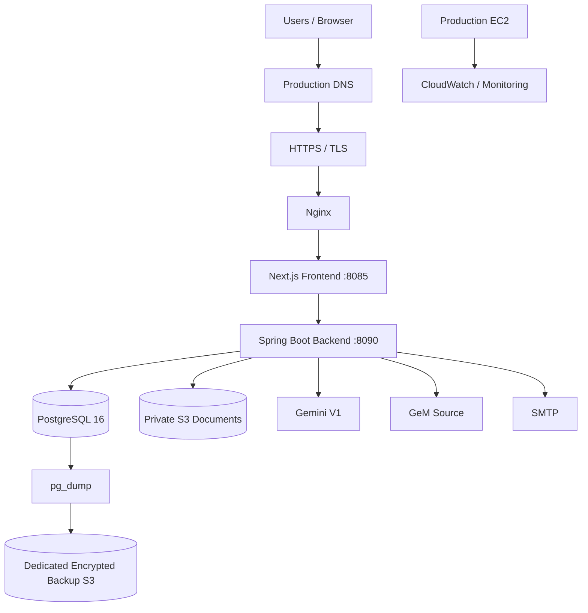

# Tender Pocket — Production Deployment Guide

**Target:** Production  
**AWS Region:** `ap-south-1` (Mumbai)  
**Stack:** Next.js + Spring Boot / Java 21 + PostgreSQL 16 + Docker Compose + Amazon S3 + Gemini V1 + SMTP

---

## 1. Purpose

This document is the production deployment runbook for Tender Pocket.

It covers:

- AWS infrastructure
- IAM and EC2 instance role
- networking and security groups
- private S3 document storage
- PostgreSQL 16
- Docker Compose
- production secrets
- Gemini V1 AI configuration
- SMTP
- Nginx and HTTPS
- existing data and document migration
- scheduled PostgreSQL backups
- backup restore testing
- monitoring and alerts
- GeM ingestion and scheduled jobs
- production build and release procedure
- smoke testing
- rollback and recovery
- final production sign-off

This is a **production** guide. Do not reuse UAT credentials, UAT IP addresses, temporary API keys, or development secrets.

---

## 2. Production Architecture



### Request flow

```text
Browser
  ↓ HTTPS
Production DNS
  ↓
Nginx
  ↓
Next.js frontend :8085
  ↓ /api
Spring Boot backend :8090
  ├── PostgreSQL
  ├── Private S3
  ├── Gemini V1
  ├── GeM
  └── SMTP
```

### Document flow

```text
Tender attachment
      ↓
Private S3
      ↓
Spring Boot
      ↓
Technical-specification AI service
      ↓
Structured compliance data
      ↓
Document generation
      ↓
PDF / DOCX / XLSX
      ↓
Private S3
```

PDF/DOCX/XLSX generation does **not** require AI. AI is used for technical-specification intelligence.

---

# 3. Production Sizing

The initial hosting plan uses:

- 2 vCPU
- 8 GiB RAM
- always-on EC2
- AWS Mumbai (`ap-south-1`)
- encrypted gp3 EBS
- approximately 50–100 GiB initial disk, adjusted for actual PostgreSQL, Docker, temporary-file, and application requirements

The planning workload includes approximately 20,000–30,000 historical tenders, 15–30 active users, and peak-session/tender-ingestion workloads.

Re-evaluate EC2 sizing using production metrics after go-live.

---

# 4. AWS Production Resources

Create the following resources:

```text
AWS
├── VPC
│   ├── subnet(s)
│   ├── route table
│   └── Internet Gateway / required routing
│
├── EC2 production application server
│
├── Production Security Group
│
├── Private S3 document bucket
│
├── Dedicated S3 backup bucket
│
├── IAM EC2 instance role
│
├── CloudWatch monitoring / alarms
│
└── Production DNS + HTTPS/TLS
```

Keep application resources in `ap-south-1` unless a documented production requirement requires another region.

---

# 5. Production S3 Document Bucket

Create a dedicated private bucket, for example:

```text
tender-pocket-prod-documents-<unique-suffix>
```

Required settings:

- Region: `ap-south-1`
- Block Public Access: enabled
- Object Ownership: Bucket owner enforced
- Server-side encryption: SSE-S3 or SSE-KMS
- Versioning: enabled according to the approved recovery policy
- Public ACLs: disabled
- No public bucket policy

Recommended logical layout:

```text
s3://<production-document-bucket>/
├── documents/
│   ├── tenders/
│   ├── specifications/
│   ├── generated/
│   └── templates/
```

Application documents remain private and are accessed through authorized backend operations or approved presigned URLs.

## Document retention

The hosting plan calls for archiving after 3 years.

Before enabling automatic archival or deletion:

1. Confirm legal retention requirements.
2. Confirm business retrieval requirements.
3. Confirm the approved retention policy.
4. Configure lifecycle rules only after approval.

Do not delete retained documents merely because they are old.

---

# 6. Dedicated PostgreSQL Backup Bucket

Create a **separate** bucket for database backups:

```text
tender-pocket-prod-backups-<unique-suffix>
```

Do not depend on the application document bucket as the only database recovery location.

Required settings:

- Region: `ap-south-1`
- Block Public Access: enabled
- Object Ownership: Bucket owner enforced
- Server-side encryption: enabled
- Versioning: enabled
- no public access

Recommended layout:

```text
s3://<production-backup-bucket>/
└── postgres/
    ├── daily/
    └── monthly/
```

---

# 7. IAM — EC2 Instance Role

Create an EC2 IAM role:

```text
TenderPocketProductionEC2Role
```

Trusted service:

```text
EC2
```

The application should use the EC2 instance role rather than long-lived AWS access keys.

Minimum application permissions for the document bucket should be limited to what the application actually requires.

Example:

```json
{
  "Version": "2012-10-17",
  "Statement": [
    {
      "Sid": "ListProductionBucket",
      "Effect": "Allow",
      "Action": ["s3:ListBucket"],
      "Resource": "arn:aws:s3:::<production-document-bucket>"
    },
    {
      "Sid": "ReadWriteProductionObjects",
      "Effect": "Allow",
      "Action": [
        "s3:GetObject",
        "s3:PutObject",
        "s3:DeleteObject"
      ],
      "Resource": "arn:aws:s3:::<production-document-bucket>/*"
    }
  ]
}
```

If the backup mechanism runs with the EC2 role, grant only the required backup permissions to the backup bucket.

Do not use `s3:*` without a documented reason.

Do not place AWS access keys or secret keys in `.env` when the EC2 role is available.

---

# 8. EC2 Production Server

Create the application server in `ap-south-1`:

- Ubuntu LTS
- x86_64
- 2 vCPU
- 8 GiB RAM
- gp3 EBS
- EBS encryption enabled
- approximately 50–100 GiB initial disk
- attach `TenderPocketProductionEC2Role`

Documents should live in S3 rather than permanently consuming the EC2 root disk.

---

# 9. Production Security Group

Recommended inbound rules:

| Port | Source | Purpose |
|---|---|---|
| 443 | Internet | HTTPS |
| 80 | Internet | Optional HTTP → HTTPS redirect |
| 22 | Restricted admin IP/VPN/bastion | Administration |

Do **not** expose these publicly:

```text
5432  PostgreSQL
8090  Spring Boot
8085  Next.js
```

Expected production path:

```text
Internet
   ↓
HTTPS
   ↓
Nginx
   ↓
Next.js / backend proxy
   ↓
PostgreSQL / S3 / Gemini / SMTP
```

Never allow production SSH from `0.0.0.0/0`.

---

# 10. Host Preparation

Update Ubuntu:

```bash
sudo apt update
sudo apt upgrade -y
```

Install required packages:

```bash
sudo apt install -y \
  git \
  curl \
  unzip \
  ca-certificates \
  gnupg \
  nginx \
  jq \
  postgresql-client
```

Install Docker Engine and the Docker Compose plugin using Docker's official installation procedure for the selected Ubuntu LTS release.

Verify:

```bash
docker --version
docker compose version
```

---

# 11. Clone the Production Release

Use the approved production repository and an immutable release commit or tag.

Example:

```bash
sudo mkdir -p /opt
cd /opt

sudo git clone <approved-production-repository-url> tender-pocket
sudo chown -R $USER:$USER /opt/tender-pocket

cd /opt/tender-pocket

git status
git rev-parse HEAD
```

Record the exact commit SHA deployed to production.

Do not deploy an unreviewed working tree.

---

# 12. Repository Structure

The production repository contains:

```text
tender-pocket/
├── backend/
│   ├── pom.xml
│   ├── Dockerfile
│   └── src/
│
├── frontend/
│   ├── package.json
│   ├── Dockerfile
│   └── src/
│
├── docker-compose.yml
└── ...
```

The Spring Boot backend is the authoritative API, workflow, and document-generation layer.

The Next.js application provides the frontend and API proxy layer.

---

# 13. PostgreSQL 16

The production Docker Compose stack uses:

```text
PostgreSQL 16
Database: tender_pocket
```

The initial architecture runs PostgreSQL in Docker on the same EC2 host.

The scale-up path is Amazon RDS PostgreSQL when availability, operations, or scale justify migration.

## Database configuration

The actual Compose configuration uses:

```env
POSTGRES_DB=tender_pocket
DATABASE_USERNAME=postgres
DATABASE_PASSWORD=<production-secret>
```

Spring Boot receives:

```env
SPRING_DATASOURCE_URL=jdbc:postgresql://postgres:5432/tender_pocket?sslmode=disable
SPRING_DATASOURCE_USERNAME=postgres
SPRING_DATASOURCE_PASSWORD=<production-secret>
```

Use the exact environment-variable names expected by the current Compose file.

## Persistent storage

PostgreSQL uses the persistent Docker volume:

```text
postgres_data
```

Never run production PostgreSQL without persistent storage.

Never run:

```bash
docker compose down -v
```

in production unless intentional database destruction has been explicitly approved and a verified restore path exists.

## Network

PostgreSQL must remain internal to the Docker network.

Never expose port `5432` publicly.

---

# 14. PostgreSQL Authority

Production PostgreSQL must be the authoritative application database.

The codebase has historically contained SQLite-related fallback behavior. Production must be configured and tested so that:

```text
Application
    ↓
PostgreSQL
```

is authoritative.

A PostgreSQL connection failure must not silently cause production to serve stale/local SQLite data.

---

# 15. Production `.env`

Create the production `.env` outside Git.

Example structure:

```env
POSTGRES_DB=tender_pocket
DATABASE_USERNAME=postgres
DATABASE_PASSWORD=<strong-production-password>

SPRING_DATASOURCE_URL=jdbc:postgresql://postgres:5432/tender_pocket?sslmode=disable
SPRING_DATASOURCE_USERNAME=postgres
SPRING_DATASOURCE_PASSWORD=<strong-production-password>

JWT_SECRET=<long-random-production-secret>
JWT_EXPIRATION=315360000

ADMIN_DEFAULT_PASSWORD=<production-secret>
MISTEAM_DEFAULT_PASSWORD=<production-secret>
EXECUTIVE_DEFAULT_PASSWORD=<production-secret>
CLEARANCE_DEFAULT_PASSWORD=<production-secret>
TPC_DEFAULT_PASSWORD=<production-secret>

AWS_REGION=ap-south-1
AWS_S3_BUCKET_NAME=<production-document-bucket>
AWS_S3_ENABLED=true

ALLOWED_ORIGINS=https://<production-domain>

BACKEND_URL=http://tender-pocket-backend:8090

GEMINI_API_KEY=<production-gemini-key>

SPRING_MAIL_HOST=smtp.gmail.com
SPRING_MAIL_PORT=465
SPRING_MAIL_USERNAME=<production-smtp-user>
SPRING_MAIL_PASSWORD=<production-smtp-password>
SPRING_MAIL_SMTP_AUTH=true

IMAP_HOST=imap.gmail.com
IMAP_PORT=993
IMAP_USERNAME=<if-required>
IMAP_PASSWORD=<if-required>
IMAP_SENDER_FILTER=<if-required>
```

Only define variables required by the release.

Protect the file:

```bash
chmod 600 /opt/tender-pocket/.env
```

Never commit:

- `.env`
- API keys
- JWT secrets
- SMTP passwords
- database passwords
- AWS access keys
- production credentials

---

# 16. Authentication

Generate a strong random production JWT secret.

Do not use development or UAT secrets.

Core roles include:

```text
admin
misteam
executive
clearance
tpc
```

Verify:

- each role can authenticate
- role-specific permissions work
- authorization is enforced by the backend
- restricted API endpoints cannot be accessed by unauthorized roles

Do not rely only on frontend-hidden buttons for security.

---

# 17. S3 Application Configuration

The current application expects:

```env
AWS_REGION=ap-south-1
AWS_S3_BUCKET_NAME=<production-document-bucket>
AWS_S3_ENABLED=true
```

The EC2 instance role supplies AWS credentials.

Do not configure:

```env
AWS_ACCESS_KEY_ID=...
AWS_SECRET_ACCESS_KEY=...
```

unless there is an explicitly approved architecture requiring them.

---

# 18. Gemini V1 AI Configuration

The current production AI direction is the **Gemini V1 technical-specification implementation**.

The AI-dependent functionality is technical-specification intelligence.

Normal PDF/DOCX/XLSX document rendering does not require AI.

Configure:

```env
GEMINI_API_KEY=<production-gemini-key>
```

Do not hardcode the Gemini key.

Do not commit the key to Git.

The original Azure OpenAI implementation should remain available as a reference/fallback implementation, but production must use the provider approved for the release.

For the current Gemini V1 release, verify that the application is actually using:

```text
AISpecificationIntelligenceServiceV1
```

and not silently falling back to the old Azure implementation.

---

# 19. Email / SMTP

The backend uses Spring Mail.

Configure a dedicated production mailbox:

```env
SPRING_MAIL_HOST=smtp.gmail.com
SPRING_MAIL_PORT=465
SPRING_MAIL_USERNAME=<smtp-user>
SPRING_MAIL_PASSWORD=<smtp-password>
SPRING_MAIL_SMTP_AUTH=true
```

Test:

- notification email
- approval-related email
- generated-document links
- production-domain links

Do not use temporary UAT Gmail credentials in production.

---

# 20. Docker Compose Services

The actual Compose **service names** are:

```text
postgres
tender-pocket-backend
tender-pocket-frontend
```

The container names are:

```text
tender-pocket-postgres
tender-pocket-backend
tender-pocket-frontend
```

This distinction is important.

For example:

```bash
docker compose build tender-pocket-backend
```

is correct.

This is **not** correct:

```bash
docker compose build backend
```

unless the Compose file is explicitly changed to define a `backend` service.

Expected dependency flow:

```text
tender-pocket-frontend
        ↓
tender-pocket-backend
        ↓
postgres
```

The backend also communicates with:

```text
S3
Gemini
GeM
SMTP
```

---

# 21. Production Build

From the project root:

```bash
cd /opt/tender-pocket
```

Check the release:

```bash
git status
git rev-parse HEAD
```

Build the complete stack:

```bash
docker compose build
```

For a deliberate clean build:

```bash
docker compose build --no-cache
```

The backend Dockerfile builds the Java application with Java 21.

The frontend Dockerfile builds the Next.js production application.

Do not deploy if the build fails.

---

# 22. Start Production

Start the complete stack:

```bash
docker compose up -d
```

Check:

```bash
docker compose ps
```

The expected services are:

```text
postgres
tender-pocket-backend
tender-pocket-frontend
```

Check logs:

```bash
docker compose logs --tail=100 postgres
docker compose logs --tail=100 tender-pocket-backend
docker compose logs --tail=100 tender-pocket-frontend
```

Look for startup failures, database connection errors, Spring bean errors, Gemini configuration errors, or frontend runtime failures.

---

# 23. Targeted Build / Restart

If only the application images changed, do not unnecessarily recreate PostgreSQL.

Backend + frontend:

```bash
docker compose build --no-cache tender-pocket-backend tender-pocket-frontend
docker compose up -d tender-pocket-backend tender-pocket-frontend
```

Then verify:

```bash
docker compose ps
```

PostgreSQL remains on its persistent volume.

---

# 24. Health Checks

## Frontend

The frontend is exposed locally on port `8085`.

```bash
curl -I http://localhost:8085/
```

## Backend

The Compose healthcheck uses:

```bash
curl -i http://localhost:8090/api/health
```

## Database

Use the actual container name:

```bash
docker exec tender-pocket-postgres \
  psql -U postgres -d tender_pocket \
  -c "SELECT current_database(), COUNT(*) FROM tenders;"
```

Do not place database passwords directly in shell commands if avoidable.

---

# 25. Nginx and HTTPS

Production must use a stable domain.

Example:

```text
tender.example.com
```

The public path is:

```text
https://tender.example.com
        ↓
      Nginx
        ↓
localhost:8085
        ↓
Next.js
        ↓
localhost:8090
```

Nginx should:

- terminate TLS when TLS is terminated on EC2
- redirect HTTP to HTTPS
- proxy to Next.js
- preserve required forwarding headers
- enforce appropriate request/body limits
- prevent public access to backend/database ports

If TLS is terminated by an AWS load balancer instead, use that architecture consistently.

Do not permanently operate production at:

```text
http://<public-ip>:8085
```

---

# 26. Existing Database Migration

When migrating an existing Tender Pocket environment:

1. Stop source writes.
2. Take a verified source backup.
3. Export PostgreSQL.
4. Transfer the backup securely.
5. Restore PostgreSQL.
6. Verify row counts.
7. Verify users and roles.
8. Verify audit history.
9. Verify S3 document references.
10. Verify representative tenders and documents.
11. Run smoke tests.
12. Open production writes only after verification passes.

Example:

```bash
pg_dump -Fc -d tender_pocket -f tender_pocket_YYYYMMDD.dump
```

Restore:

```bash
pg_restore -d tender_pocket tender_pocket_YYYYMMDD.dump
```

Use secure authentication.

---

# 27. Document Migration

Database migration does not automatically migrate document objects.

Verify the complete relationship:

```text
Tender record
    +
S3 object
    +
S3 object key / metadata
    =
Complete tender
```

Test representative:

- tender attachments
- technical specifications
- generated PDFs
- generated DOCX files
- generated XLSX files
- bid documents
- templates

---

# 28. Daily PostgreSQL Backup

Production requires a nightly full PostgreSQL backup stored separately from the EC2 root disk.

Required flow:

```text
PostgreSQL
    ↓
pg_dump
    ↓
Compressed backup
    ↓
Dedicated encrypted S3 backup bucket
    ↓
Retention policy
```

Recommended starting retention:

```text
30 daily backups
12 monthly backups
```

Follow the organization's approved retention policy if it is longer.

---

# 29. Implement the Backup Scheduler

Choose one approved host scheduler, such as a `systemd` timer or cron.

Example cron approach:

Create a protected backup script:

```bash
sudo mkdir -p /opt/tender-pocket/scripts
sudo nano /opt/tender-pocket/scripts/backup-postgres.sh
```

The script should:

1. create a timestamped `pg_dump`
2. verify the dump succeeded
3. upload it to the dedicated S3 backup bucket
4. verify the upload
5. remove local temporary backup files after successful upload
6. return a non-zero exit code on failure

The script must not contain hardcoded production passwords or AWS keys.

Use the EC2 IAM role for S3 access.

Schedule it once per night using the approved scheduler.

After enabling it, perform one manual run and verify the object exists in the backup bucket.

---

# 30. Monthly Backup Retention

At month-end:

```text
Daily backups
     ↓
Monthly retained copy
     ↓
Long-term encrypted storage
```

Do not delete daily copies until the monthly retention process has succeeded.

The exact retention period must follow the approved production policy.

---

# 31. Backup Restore Test

A backup is not considered operationally complete until restoration has been tested.

Test:

```text
Backup
  ↓
Temporary PostgreSQL restore
  ↓
Integrity checks
  ↓
Tender count check
  ↓
User check
  ↓
Representative tender check
  ↓
PASS / FAIL record
```

Perform a restore test before production go-live and periodically afterwards.

---

# 32. Monitoring

Monitor at least:

## EC2

- CPU
- memory
- disk usage
- disk I/O
- network
- instance status

## Docker

- container status
- health status
- restart count
- application logs

## PostgreSQL

- connection failures
- database size
- disk growth
- slow queries
- backup success/failure

## Application

- HTTP 5xx
- authentication failures
- S3 failures
- document-generation failures
- Gemini failures
- scheduler failures

---

# 33. Alerts

Create alerts for:

```text
EC2 unavailable
Disk > 80%
Sustained high CPU
Backend unhealthy
Frontend unavailable
PostgreSQL unhealthy
Backup missing
Backup failed
High HTTP 5xx rate
Gemini/API failure
Scheduler failure
```

Backup failure must be visible to an operator.

---

# 34. GeM Ingestion

The expected application flow is:

```text
GeM
 ↓
GeMScraperService
 ↓
Tender parsing
 ↓
PostgreSQL
 ↓
Workflow / dashboard
```

Monitor for:

- source changes
- HTTP failures
- rate limiting
- duplicates
- malformed records
- scheduler failures

Verify scheduled ingestion actually executes in production.

---

# 35. Scheduler / Background Work

For every scheduled/background job verify:

1. It starts.
2. It runs.
3. It completes.
4. Failures are logged.
5. Retry/backoff behavior works where implemented.
6. Duplicate execution does not corrupt data.

Heavy PDF/OCR/AI workloads should move toward a controlled queue/worker architecture as production scale increases.

---

# 36. Pre-Deployment Tests

Backend:

```bash
cd backend
./mvnw test
```

or:

```bash
mvn test
```

Frontend:

```bash
cd frontend
npm ci
npm run build
```

Repository checks:

```bash
git diff --check
git status
```

Before release:

- no secrets are committed
- no unintended files are tracked
- build succeeds
- tests pass
- approved commit/tag is recorded

---

# 37. Production Smoke Test

After every release, test:

## Authentication

- Admin login
- MIS Team login
- Tender Executive login
- Clearance Team login
- TPC Team login

## Dashboard

- dashboard loads
- metrics load
- tender count is correct

## Tenders

- All Tenders loads
- search works
- filters work
- detail page opens

## Authorization

- permitted action succeeds
- restricted action returns the expected authorization failure

## Documents

- existing document downloads
- S3 object is available
- generated document works

## Technical Specification / Gemini V1

If AI is enabled:

1. upload a representative technical specification/tender document
2. verify Gemini V1 is invoked
3. verify AI extraction completes
4. verify structured clauses are produced
5. verify required clause fields are populated
6. verify downstream workflow accepts the result
7. verify document generation from the resulting data
8. inspect logs for Gemini/API errors
9. verify no Azure dependency is unexpectedly required

---

# 38. Role Verification

Core roles:

```text
Admin
MIS Team
Tender Executive
Clearance Team
TPC Team
```

Verify the actual permission matrix against the current backend `WorkflowPermissions` implementation.

Do not rely only on hidden frontend buttons.

Authorization must be enforced server-side.

---

# 39. Production Release Procedure

Every release should follow this order:

```text
Code change
    ↓
Backend tests
    ↓
Frontend build
    ↓
Security review
    ↓
Approved commit/tag
    ↓
Production DB backup
    ↓
Pull exact release
    ↓
Verify commit SHA
    ↓
Build Docker images
    ↓
Start/restart application
    ↓
Health checks
    ↓
Smoke test
    ↓
Monitor
    ↓
Release sign-off
```

For an application-only release:

```bash
cd /opt/tender-pocket

git fetch --all --tags
git checkout <approved-release-tag-or-commit>

git rev-parse HEAD

docker compose build
docker compose up -d

docker compose ps
```

Do not use an arbitrary branch or uncommitted working tree for production.

---

# 40. Rollback

Before every production deployment:

1. Record the current deployed commit SHA.
2. Verify the latest database backup.
3. Record the Docker image/build state.
4. Deploy the new approved release.
5. Run health checks.
6. Run smoke tests.

If the application release fails:

```text
Stop new release
      ↓
Inspect logs
      ↓
Decide application rollback vs database recovery
      ↓
Restore previous application release if appropriate
      ↓
Verify PostgreSQL state
      ↓
Health checks
      ↓
Smoke test
```

Do not automatically restore the database merely because an application container failed.

Database restoration is a separate recovery decision.

---

# 41. Disaster Recovery

Recovery priorities:

1. Restore infrastructure/network access.
2. Restore application release.
3. Restore PostgreSQL from the latest verified backup if required.
4. Restore/verify S3 document access.
5. Verify user authentication.
6. Verify representative tenders.
7. Verify generated documents.
8. Verify Gemini V1 if AI is required.
9. Run the complete smoke test.
10. Record recovery outcome.

The backup and restore process must be practiced, not merely documented.

---

# 42. Production Security Checklist

Before go-live:

- [ ] Production-only JWT secret
- [ ] Production-only database password
- [ ] Production-only SMTP credentials
- [ ] Production-only Gemini API key
- [ ] No secrets in Git
- [ ] `.env` permissions restricted
- [ ] S3 Block Public Access enabled
- [ ] S3 encryption enabled
- [ ] EC2 IAM role attached
- [ ] No AWS access keys in `.env`
- [ ] PostgreSQL not publicly accessible
- [ ] Backend port not publicly accessible
- [ ] Frontend port not publicly accessible
- [ ] SSH restricted
- [ ] HTTPS enabled
- [ ] HTTP redirects to HTTPS
- [ ] Production CORS restricted to production domain
- [ ] PostgreSQL persistent volume verified
- [ ] Nightly backup configured
- [ ] Backup upload verified
- [ ] Restore test completed
- [ ] Monitoring enabled
- [ ] Backup alerts enabled
- [ ] AI provider verified
- [ ] SMTP verified
- [ ] GeM scheduler verified
- [ ] Role authorization verified

---

# 43. Final Production Sign-Off

Do not consider production deployment complete until all of the following are true:

```text
Infrastructure
    ✓ EC2 running
    ✓ Security group verified
    ✓ IAM role verified
    ✓ S3 document bucket verified
    ✓ S3 backup bucket verified

Application
    ✓ Backend build passed
    ✓ Frontend build passed
    ✓ Docker services running
    ✓ Backend health check passed
    ✓ Frontend health check passed
    ✓ PostgreSQL healthy

Security
    ✓ Secrets protected
    ✓ HTTPS active
    ✓ Public application ports closed
    ✓ PostgreSQL private
    ✓ Authorization verified

Data
    ✓ Database migrated/verified
    ✓ S3 documents verified
    ✓ Backup completed
    ✓ Restore test passed

Integrations
    ✓ Gemini V1 verified
    ✓ SMTP verified
    ✓ GeM ingestion verified
    ✓ Scheduled jobs verified

Validation
    ✓ Authentication smoke tests passed
    ✓ Tender workflow passed
    ✓ Document generation passed
    ✓ Technical specification AI passed
    ✓ Role authorization passed
```

Record:

```text
Production release:
Commit SHA:
Release date:
Database backup:
Backup verification:
Restore test:
AI provider:
AI model:
Production domain:
Operator:
Reviewer:
Final status:
```

---

# 44. Important Production Rules

1. Never expose PostgreSQL publicly.
2. Never expose Spring Boot port `8090` publicly.
3. Never expose Next.js port `8085` publicly in the final production architecture.
4. Never use UAT secrets in production.
5. Never commit `.env` or API keys.
6. Never use long-lived AWS keys when the EC2 IAM role is available.
7. Never run `docker compose down -v` casually in production.
8. Never deploy without a verified database backup.
9. Never call a backup successful until the backup object has been verified.
10. Never call disaster recovery ready until restoration has been tested.
11. Never assume an AI model/provider is configured merely because its environment variable exists.
12. Always verify that the deployed AI implementation is the intended `AISpecificationIntelligenceServiceV1`.
13. Always record the exact deployed commit SHA.
14. Always perform health checks and smoke tests after deployment.
15. Treat production data and documents as authoritative and protected.

---

# 45. Quick Production Command Reference

From:

```bash
cd /opt/tender-pocket
```

Check release:

```bash
git status
git rev-parse HEAD
```

Build everything:

```bash
docker compose build
```

Clean build:

```bash
docker compose build --no-cache
```

Start:

```bash
docker compose up -d
```

Check services:

```bash
docker compose ps
```

Correct Compose service names:

```text
postgres
tender-pocket-backend
tender-pocket-frontend
```

Rebuild application only:

```bash
docker compose build --no-cache tender-pocket-backend tender-pocket-frontend
```

Restart application only:

```bash
docker compose up -d tender-pocket-backend tender-pocket-frontend
```

Backend logs:

```bash
docker compose logs --tail=200 tender-pocket-backend
```

Frontend logs:

```bash
docker compose logs --tail=200 tender-pocket-frontend
```

Database logs:

```bash
docker compose logs --tail=200 postgres
```

Backend health:

```bash
curl -i http://localhost:8090/api/health
```

Frontend health:

```bash
curl -I http://localhost:8085/
```

Database verification:

```bash
docker exec tender-pocket-postgres \
  psql -U postgres -d tender_pocket \
  -c "SELECT current_database(), COUNT(*) FROM tenders;"
```

---

## Production principle

The production deployment should be:

```text
Immutable approved release
        ↓
Encrypted infrastructure
        ↓
Private database
        ↓
Private S3 documents
        ↓
Dedicated encrypted backups
        ↓
Gemini V1 for technical intelligence
        ↓
HTTPS public entry point
        ↓
Health checks
        ↓
Smoke tests
        ↓
Monitoring + recovery
```

This is the required operating model for a repeatable Tender Pocket production deployment.
